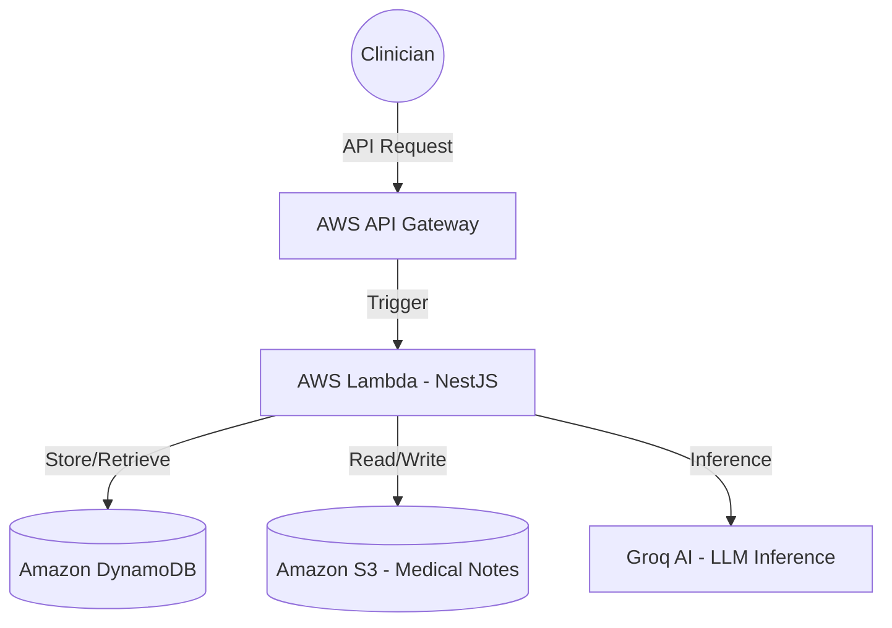

# EHR Annotation Platform - Backend

Enterprise-grade serverless backend for clinical document annotation, built with NestJS and deployed on AWS.

## 🔗 Repository Links
- **Backend**: [https://github.com/harsh-vardhhan/EHR-backend](https://github.com/harsh-vardhhan/EHR-backend)
- **Frontend**: [https://github.com/harsh-vardhhan/EHR-frontend](https://github.com/harsh-vardhhan/EHR-frontend)

## 🏗 AWS Architecture

The backend follows a highly scalable, serverless architecture designed for clinical data residency and high availability.



### Infrastructure Components:
- **AWS Lambda**: Executes the NestJS application in a serverless environment, scaling automatically with request volume.
- **Amazon DynamoDB**: NoSQL database for ultra-low latency storage of annotation metadata and document status.
- **Amazon S3**: Secure, encrypted storage for raw clinical document text.
- **Amazon API Gateway**: Managed entry point for the frontend, handling routing and CORS.
- **Groq AI Integration**: Powers the clinical entity recognition using high-performance LLM inference.

## 🚀 CI/CD Pipeline

The project uses GitHub Actions for an automated, zero-downtime deployment workflow.

### Continuous Integration (CI)
- **Linting**: Automated TypeScript linting ensures code quality.
- **Type Checking**: Strict TypeScript validation before every merge.
*Triggered on all Pull Requests to `main`.*

### Continuous Deployment (CD)
- **Build & Bundle**: Compiles NestJS and uses `esbuild` for an optimized Lambda package.
- **AWS SAM (Serverless Application Model)**: Manages infrastructure as code, deploying the CloudFormation stack automatically.
- **Automatic Environment Sync**: Injects AWS secrets and environment variables during the build process.
*Triggered on every push to `main`.*

## 🛠 Local Development

### Prerequisites
- Node.js 20+
- AWS CLI (configured for local testing)
- SAM CLI (optional, for local Lambda emulation)

### Setup
```bash
$ npm install
```

### Running Locally
```bash
# development
$ npm run start:dev
```

## 📜 Key Scripts
- `npm run build`: Compiles the application.
- `npm run bundle`: Creates a production-ready esbuild bundle for AWS Lambda.
- `npm run lint`: Runs the linter.
- `npm run test`: Executes unit tests.

---
*Built for the Modern Clinical Workflow.*
