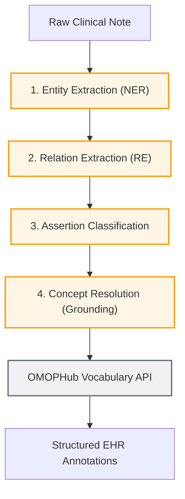
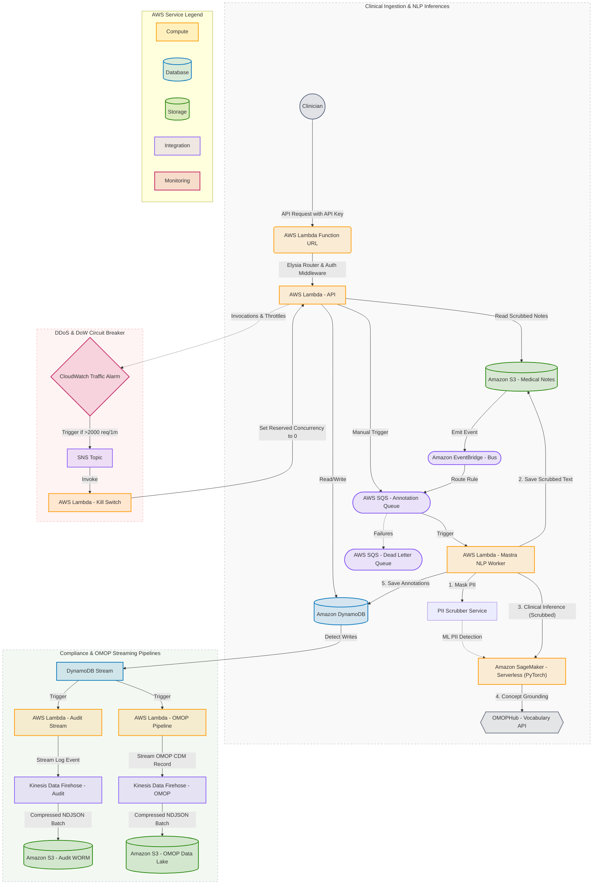
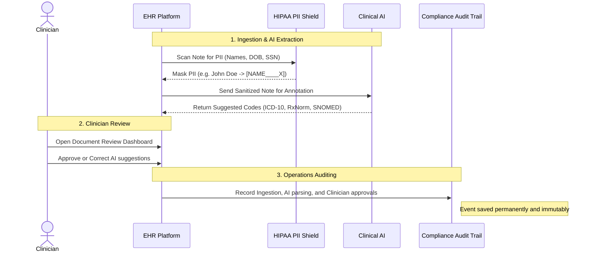

# EHR Annotation Platform - Cloud-Native Clinical NLP Backend

Enterprise-grade serverless backend for clinical document annotation, built with Elysia and deployed on AWS.

[](https://github.com/harsh-vardhhan/EHR-backend/actions/workflows/ci.yml)
[](https://github.com/harsh-vardhhan/EHR-backend/actions/workflows/deploy-backend.yml)

**🚀 Live Demo:** [https://ehr-backend-frontend.vercel.app/](https://ehr-backend-frontend.vercel.app/)

### Key Capabilities
*   **Clinical Named Entity Recognition (NER):** Parse raw EHR notes to identify critical health variables.
*   **Medical Ontology Tagging:** Automated ICD-10, RxNorm, and SNOMED-CT dictionary code lookups.
*   **Clinical Assertion Parsing:** Distinguish positive, negated (ruled-out), and speculated medical claims.
*   **Automated PII De-identification:** HIPAA-aligned safe-harbor clinical PII scrubber pipeline.

## 🏥 Clinical NLP & Health-Tech Domain Design

This platform is engineered to mirror real-world EHR aggregation pipelines. It handles the parsing, validation, and structuring of raw clinical narratives into standardized, research-ready health datasets.

### 🧠 Machine Learning Models & Task Mapping

The clinical NLP workflow unifies extraction, assertion, and grounding tasks across multiple specialized deep learning models hosted inside the SageMaker container:

| Clinical NLP Task | Machine Learning Model | Key Responsibility | Execution Layer |
| :--- | :--- | :--- | :--- |
| **Entity Extraction (NER)** | [`Ihor/gliner-biomed-base-v1.0`](https://huggingface.co/Ihor/gliner-biomed-base-v1.0) | Extracts clinical entities (Conditions, Findings, Medications, Procedures) from raw notes. | SageMaker (PyTorch) |
| **Relation Extraction (RE)** | [`knowledgator/gliner-relex-base-v1.0`](https://huggingface.co/knowledgator/gliner-relex-base-v1.0) | Predicts relationships between extracted entities (e.g. `treatment_for`, `associated_with`). | SageMaker (PyTorch) |
| **Assertion Classification** | [`bvanaken/clinical-assertion-negation-bert`](https://huggingface.co/bvanaken/clinical-assertion-negation-bert) | Classifies entities contextually as *Positive*, *Negated* (ruled-out), or *Possible* (speculative). | SageMaker (PyTorch) |
| **Concept Resolution** | [`cambridgeltl/SapBERT-from-PubMedBERT-fulltext`](https://huggingface.co/cambridgeltl/SapBERT-from-PubMedBERT-fulltext) | Computes semantic token embeddings to rerank candidate lookups and map them to SNOMED/RxNorm codes. | SageMaker (PyTorch) |



### Clinical Assertion Status (Negation & Speculation)
In clinical NLP, identifying a disease term is only half the battle. We must determine its **assertion status** (contextual modifier) to prevent critical medical errors:
*   **Positive (Active):** Conditions the patient currently has (e.g., *"patient has asthma"*).
*   **Negated (Ruled Out):** Conditions explicitly denied (e.g., *"denies chest pain"*). Misclassifying a negated symptom as an active condition leads to incorrect diagnoses and billing errors.
*   **Possible (Hypothetical):** Speculative diagnoses under investigation (e.g., *"suspect bronchitis, rule out pneumonia"*), tracking diagnostic uncertainty.

### Concept Resolution & Taxonomy Mapping
To eliminate model hallucinations and ensure accurate coding, the extracted terms are resolved in bulk against standard vocabularies using **OMOPHub** (https://omophub.com) by computing semantic token embeddings via SapBERT:
*   **Clinical Conditions** (e.g., *"Type 2 Diabetes"*): Mapped to **ICD-10-CM** (International Classification of Diseases, 10th Revision, Clinical Modification) codes, the gold standard for clinical classification and diagnostic billing.
*   **Medication Statements** (e.g., *"Metformin 500mg daily"*): Mapped to **RxNorm** Concept Unique Identifiers (CUIs), ensuring precise drug-name normalization and interaction safety checks.
*   **Clinical Findings & Symptoms** (e.g., *"Chest tightness"*): Mapped to **SNOMED-CT** (Systematized Nomenclature of Medicine—Clinical Terms) codes to ensure vocabulary consistency across clinical records.
*   **Medical Procedures** (e.g., *"Chest X-Ray"*): Mapped to **CPT** (Current Procedural Terminology) or **SNOMED-CT** codes for tracking operations and clinical interventions.

### HIPAA & Data Privacy Architecture
*   **Data Residency:** All clinical notes are isolated in an encrypted Amazon S3 bucket using KMS Customer Managed Keys (CMKs). DynamoDB stores strictly structured, de-identified annotation offsets and concept mappings.
*   **PII Masking & Privacy:** The asynchronous ingestion pipeline runs automated PII scrubbing (detecting names, dates, phone numbers, SSNs, MRNs) via a Mastra AI workflow before clinical NLP inference, storing scrubbed notes in S3 (`scrubbed/`) and de-identified annotations in DynamoDB.

## 🏗 AWS Architecture

The backend follows a highly scalable, serverless architecture designed for clinical data residency and high availability.



## 🏥 Compliance Business Workflow

This simplified sequence diagram tracks the lifecycle of a clinical note from raw ingestion through AI scrubbing, clinician verification, and immutable auditing:



### Infrastructure Components

| Component | Role in Architecture |
| :--- | :--- |
| **AWS Lambda (API)** | Executes the Elysia application, handling UI interactions and document metadata orchestration. |
| **AWS Lambda (Mastra NLP Worker)** | Dedicated asynchronous worker triggered by SQS executing a Mastra AI workflow (`@mastra/core`) for PII scrubbing, SageMaker entity/relation extraction, and OMOP vocabulary concept resolution. |
| **AWS Lambda (Kill Switch)** | Administrative helper triggered by SNS to throttle the API Lambda reserved concurrency to 0. |
| **AWS Lambda (Audit Stream Consumer)** | Asynchronous event consumer triggered by DynamoDB Streams to filter and forward audit logs to Firehose. |
| **AWS Lambda (OMOP Pipeline)** | Asynchronous event consumer triggered by DynamoDB Streams to map clinical annotations to standard OMOP format and forward them to Firehose. |
| **Amazon Kinesis Data Firehose (Audit)** | Delivery stream buffering and compressing NDJSON audit events, writing them in GZIP format to the Audit WORM bucket. |
| **Amazon Kinesis Data Firehose (OMOP)** | Delivery stream buffering and compressing NDJSON OMOP records, writing them in GZIP format to S3. |
| **Amazon SQS & DLQ** | Decouples document ingestion from analysis, buffers surges, and quarantines failed tasks in a Dead Letter Queue. |
| **Amazon DynamoDB** | Managed NoSQL storage for ultra-low latency storage of clinical annotation metadata and document status. |
| **Amazon S3 (Medical Notes)** | Encrypted object storage for raw clinical document text, acting as the event source for the ingestion pipeline. |
| **Amazon S3 (Audit WORM Bucket)** | Secure compliance bucket protected by S3 Object Lock (Compliance Mode) storing immutable audit logs. |
| **Amazon S3 (OMOP Data Lake)** | Shared object storage hosting the structured, search-ready clinical data files under the `omop/` folder prefix. |
| **Lambda Function URL** | Public HTTPS endpoint routing requests directly to the Elysia backend. |
| **CloudWatch Alarm & SNS** | Monitors total request volume (Invocations + Throttles) in real-time, acting as the circuit breaker sensor. |
| **SageMaker Serverless (PyTorch)** | High-performance machine learning inference endpoint hosting the specialized clinical NLP deep learning models for extraction, relation prediction, assertion classification, and concept grounding. |

## 🗄️ DynamoDB Single-Table Design for Clinical Records

To maximize performance, cut database costs, and eliminate cross-table JOIN latency, this application uses a consolidated **Single-Table Design** layout (`EhrTable`) modeled with **ElectroDB**. ElectroDB provides type-safe schemas, validates attributes, and automatically formats keys and index queries without raw SDK query strings.

### Key Schema Layout

| PK (Partition Key) | SK (Sort Key) | Index Name | Entity Type | Attributes & Schema |
| :--- | :--- | :--- | :--- | :--- |
| `DOCUMENT#<id>` | `METADATA` | Primary | **Document** | `id`, `title`, `category`, `s3Key`, `status`, `createdAt` |
| `DOCUMENT#<documentId>` | `ANNOTATION#<annotationId>` | Primary | **Annotation** | `annotationId`, `documentId`, `text`, `label`, `startOffset`, `endOffset`, `createdAt`, `source`, `status`, `confidence`, `assertion`, `conceptCode` |
| `DOCUMENT#<documentId>` | `RELATIONSHIP#<relationshipId>` | Primary | **Relationship** | `relationshipId`, `documentId`, `sourceAnnotationId`, `targetAnnotationId`, `relationType`, `confidence`, `createdAt` |
| `DOCUMENT#<documentId>` | `AUDIT#<logId>` | Primary | **Audit Log** | `logId`, `documentId`, `actionType`, `description`, `createdAt` |
| `SK` (Inverted) | `PK` | `SKIndex` (GSI) | **Annotation / Document** | Mapped for inverted parent-key resolution. |
| `ASSERTION#<assertion>` | `LABEL#<label>` | `GSI1Index` (GSI) | **Annotation** | Secondary index optimized for clinical cohort filtering. |

### Query Optimizations

1. **Concurrent Single-Table Read (Document + Annotations):** 
   When opening a patient note, the backend executes concurrent reads (`GetItem` for Document metadata and `Query` for all related Annotations) in parallel using `Promise.all` over the single table. This utilizes ElectroDB entities for strict type safety while maintaining sub-millisecond single-table responses.
2. **Inverted Index (`SKIndex`):**
   To update or delete an annotation by its `annotationId` alone (without knowing the parent `documentId`), we query the Global Secondary Index (GSI) `SKIndex` (where `HashKey = SK` and `RangeKey = PK`) mapped in ElectroDB. This resolves the parent `PK` in milliseconds, allowing targeted, isolated edits on specific rows.
3. **Clinical Cohort Search Index (`GSI1Index`):**
   To query patient annotations by medical category, assertion status, and standard ICD-10/RxNorm concept codes without performing expensive table scans, the search API targets `GSI1Index` (`GSI1PK = HASH`, `GSI1SK = RANGE`). If a filter query omits the assertion status, the service executes parallelized index queries across all three assertion states in parallel using `Promise.all` and flattens the result, ensuring consistent sub-second search speeds.

## 🛡️ Denial of Wallet (DoW) & DDoS Protection

This backend incorporates a robust, multi-layered security architecture designed to prevent volumetric DDoS abuse and cloud-native **Denial of Wallet (DoW)** attacks, guaranteeing predictable operational billing.

| Defense Vector | Implementation & Controls | Purpose & Billing Safety Impact |
| :--- | :--- | :--- |
| **Auth Gatekeeper** | Valid `x-api-key` header verified in Elysia middleware. | Rejects unauthenticated requests in ~2ms before executing database operations. |
| **Origin & Header Guard** | Validates `origin` against `ALLOWED_ORIGINS` and `x-origin-verify` secret header. | Rejects unauthorized cross-origin requests before reaching application handlers. |
| **IP Rate Limiter** | Sliding window rate limiting (60 req/min per IP) via `elysia-rate-limit`. | Prevents endpoint brute-force and request flooding attacks. |
| **Zero-Routing Cost Gateway** | Direct Lambda Function URL (no API Gateway request fees). | Eliminates API Gateway per-request charges ($3.50/million), ensuring throttled requests cost exactly $0.00. |
| **Automated Circuit Breaker** | CloudWatch Alarm (>2000 req/1m) $\rightarrow$ SNS $\rightarrow$ Kill-Switch Lambda. | Automatically updates backend Lambda reserved concurrency to `0` on breach, dropping resource billing to absolute zero. |
| **Compute Scaling Caps** | `ReservedConcurrentExecutions` limits (**2** for API Lambda, **2** for SQS NLP Worker). | Caps the maximum number of concurrent running containers AWS can spin up under a flood. |
| **Asynchronous Decoupling** | SQS-backed queue hand-off (`EhrAnnotationQueue`) with `BatchSize: 5`. | Prevents container runtime crashes; processes spikes in document uploads sequentially rather than in parallel. |
| **Infinite Retry Defense** | SQS Dead Letter Queue (`EhrAnnotationDLQ`) with `maxReceiveCount: 3`. | Quarantines failing payloads (poison pills) to prevent endless execution retry loops. |
| **Partial Batch Isolation** | SQS batch response processing with `ReportBatchItemFailures`. | Prevents successfully processed records in a batch from being re-executed when a sibling record in the same batch fails, saving redundant LLM API costs. |
| **External API Timeouts** | SageMaker NLP call `AbortController` (capped at **30 seconds**). | Prevents hung external endpoints from keeping the worker Lambda running up to its 30-second cap, while allowing ample time for large-document entity extractions. |
| **Database Cost Ceiling** | DynamoDB configured with on-demand capacity (`PAY_PER_REQUEST`). Active costs are only incurred per request (pennies for a Reddit spike) and drop to exactly $0.00 during dormancy. | Combined with the API Kill Switch, this acts as a hard budget boundary preventing runaway database scaling costs. |
| **Compute Efficiency** | Parallel database writes via `Promise.all` instead of sequential writes. | Grouped DB actions run concurrently, reducing billable Lambda active execution time by over 80%. |
| **S3 Prefix Scope & Loop Defense** | EventBridge rule filters exclusively on `documents/` key prefix for S3 events. Worker Lambda writes scrubbed text under `scrubbed/` prefix. | Prevents recursive S3 write-event trigger loops. |
| **Agentic Role Scoping** | Dev policy (`developer-policy.json`) restricts agent actions to data-plane only (S3/DynamoDB item actions) and read-only infra visibility. | Prevents AI agent hallucinations or runaway CLI scripts from deleting infrastructure or provisioning expensive, untracked resources. |

> [!TIP]
> **Manual Recovery after Circuit Breaker Activation:**
> To bring the system back online after a kill-switch trigger, reset the backend Lambda's reserved concurrency back to your desired capacity (e.g., `20` or delete the limit) via the AWS Console, AWS SDK/CLI, or by redeploying the SAM template.

## 🛠 Local Development

### Prerequisites
- Bun (v1.1+ recommended)
- AWS CLI (configured via AWS IAM Identity Center/SSO profile e.g., `ehr-dev`)
- SAM CLI (optional, for local Lambda emulation)

### Setup
1. Clone the repository and install dependencies at the monorepo root:
```bash
$ bun install
```

2. Create a `.env` file in the root of the `packages/backend` directory containing your API keys and configuration parameters:
```env
EHR_TABLE_NAME=ehr-table
DOCUMENTS_BUCKET_NAME=your_s3_bucket_name
AWS_REGION=your_aws_region
OMOPHUB_API_KEY=your_omophub_api_key
```

### Running Locally
Run the monorepo workspaces concurrently:
```bash
$ bun run dev
```

## 📜 Key Scripts
Run these scripts from the monorepo root:
- `bun run build`: Compiles all workspace packages.
- `bun run lint`: Lints the monorepo.
- `bun run test`: Executes the test suites.
- `bun --filter backend run cleanup`: Wipes all DynamoDB table items and S3 objects to reset the database.
- `bun --filter backend run seed`: Seeds the S3 bucket with sample document notes.
- `bun --filter backend test:kill-switch`: Tests CloudWatch DDoS alarm triggering and Lambda kill-switch concurrency throttling.
- `bun --filter backend test:dlq`: Tests SQS Dead-Letter Queue failure handling.
- `bun --filter backend verify:sagemaker`: Verifies SageMaker PyTorch endpoint connectivity and inference payloads.
- `bun --filter backend verify:cloud`: End-to-end cloud processing verification across S3, SQS, SageMaker, and DynamoDB.

---
*Built for the Modern Clinical Workflow.*
