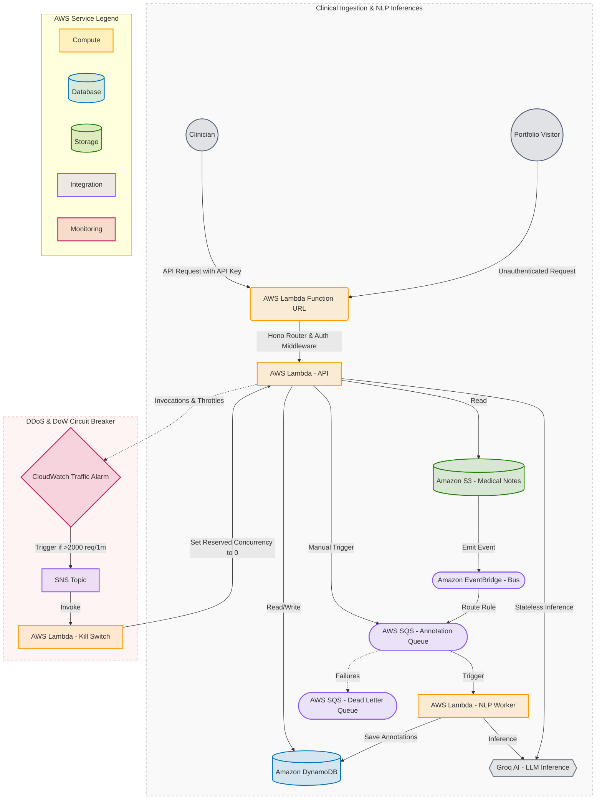

# EHR Annotation Platform - Cloud-Native Clinical NLP Backend

Enterprise-grade serverless backend for clinical document annotation, built with Hono and deployed on AWS.


**🚀 Live Demo:** [https://d1pijuvgczqoi4.cloudfront.net/](https://d1pijuvgczqoi4.cloudfront.net/)

### Key Capabilities
*   **Clinical Named Entity Recognition (NER):** Parse raw EHR notes to identify critical health variables.
*   **Medical Ontology Tagging:** Automated ICD-10, RxNorm, and SNOMED-CT dictionary code lookups.
*   **Clinical Assertion Parsing:** Distinguish positive, negated (ruled-out), and speculated medical claims.
*   **Stateless De-identification Sandbox:** HIPAA-aligned safe-harbor clinical preview engine.

## 🔗 Repository Links
*   🖥️ **Frontend React UI:** [EHR Annotation Client Dashboard Repository](https://github.com/harsh-vardhhan/EHR-frontend)
*   ⚙️ **Backend API Service:** [AWS Serverless Clinical NLP Backend Repository](https://github.com/harsh-vardhhan/EHR-backend)

## 🏥 Clinical NLP & Health-Tech Domain Design

This platform is engineered to mirror real-world EHR aggregation pipelines. It handles the parsing, validation, and structuring of raw clinical narratives into standardized, research-ready health datasets.

### 1. Clinical Entity Recognition (NER) & Taxonomy Mapping
Raw medical notes are unstructured. The platform parses these text streams and automatically extracts clinical concepts, mapping them to standard health-tech ontologies:
*   **Clinical Conditions** (e.g., *"Type 2 Diabetes"*): Mapped to **ICD-10-CM** (International Classification of Diseases, 10th Revision, Clinical Modification) codes, the gold standard for clinical classification and diagnostic billing.
*   **Medication Statements** (e.g., *"Metformin 500mg daily"*): Mapped to **RxNorm** Concept Unique Identifiers (CUIs), ensuring precise drug-name normalization and interaction safety checks.
*   **Clinical Findings & Symptoms** (e.g., *"Chest tightness"*): Mapped to **SNOMED-CT** (Systematized Nomenclature of Medicine—Clinical Terms) codes to ensure vocabulary consistency across clinical records.
*   **Medical Procedures** (e.g., *"Chest X-Ray"*): Mapped to **CPT** (Current Procedural Terminology) or **SNOMED-CT** codes for tracking operations and clinical interventions.

### 2. Clinical Assertion Status (Negation & Speculation)
In clinical NLP, identifying a disease term is only half the battle. We must determine its **assertion status** (contextual modifier) to prevent critical medical errors:
*   **Positive (Active):** Conditions the patient currently has (e.g., *"patient has asthma"*).
*   **Negated (Ruled Out):** Conditions explicitly denied (e.g., *"denies chest pain"*). Misclassifying a negated symptom as an active condition leads to incorrect diagnoses and billing errors.
*   **Possible (Hypothetical):** Speculative diagnoses under investigation (e.g., *"suspect bronchitis, rule out pneumonia"*), tracking diagnostic uncertainty.

### 3. HIPAA & Data Privacy Architecture
*   **Data Residency:** All clinical notes are isolated in an encrypted Amazon S3 bucket using KMS Customer Managed Keys (CMKs). DynamoDB stores strictly structured, de-identified annotation offsets and concept mappings.
*   **Stateless Inferences:** The public sandbox pipeline runs completely stateless with input character caps, ensuring no patient-identifiable data is cached or written to persistent storage.

## 🏗 AWS Architecture

The backend follows a highly scalable, serverless architecture designed for clinical data residency and high availability.



### Infrastructure Components

| Component | Role in Architecture |
| :--- | :--- |
| **AWS Lambda (API)** | Executes the Hono application, handling UI interactions and document metadata orchestration. |
| **AWS Lambda (NLP Worker)** | Dedicated asynchronous worker triggered by SQS to perform LLM clinical entity extraction. |
| **AWS Lambda (Kill Switch)** | Administrative helper triggered by SNS to throttle the API Lambda reserved concurrency to 0. |
| **Amazon SQS & DLQ** | Decouples document ingestion from analysis, buffers surges, and quarantines failed tasks in a Dead Letter Queue. |
| **Amazon DynamoDB** | Managed NoSQL storage for ultra-low latency storage of clinical annotation metadata and document status. |
| **Amazon S3** | Encrypted object storage for raw clinical document text, acting as the event source for the ingestion pipeline. |
| **Lambda Function URL** | Public HTTPS endpoint routing requests directly to the Hono backend. |
| **CloudWatch Alarm & SNS** | Monitors total request volume (Invocations + Throttles) in real-time, acting as the circuit breaker sensor. |
| **Groq AI Integration** | High-performance inference engine running clinical entity recognition models. |

## 🚨 Financial Warning: The Cost of Infinite Scaling

Unlike traditional servers (EC2, Render, Railway, etc.) that cap their financial damage by crashing under high load, AWS serverless applications scale **infinitely**.

Under high virality or a **DDoS attack**, an unprotected serverless stack will spin up thousands of concurrent containers instantly. This can lead to **runaway AWS bills of hundreds of thousands of dollars overnight**.

To mitigate this, this repository implements a custom **DDoS/DoW Circuit Breaker**:
1. **Zero-Base-Cost Function URLs** bypass API Gateway completely, eliminating gateway request charges ($3.50/M) for blocked requests.
2. **CloudWatch Alarm Metric Math** monitors total Lambda traffic (`Invocations + Throttles`) in a 1-minute window.
3. **Lambda Concurrency Kill Switch** automatically triggers during an anomaly, programmatically throttling the API's reserved concurrency to `0` to drop subsequent request costs to exactly **$0.00**.

## 🗄️ DynamoDB Single-Table Design for Clinical Records

To maximize performance, cut database costs, and eliminate cross-table JOIN latency, this application uses a consolidated **Single-Table Design** layout (`EhrTable`) modeled with **ElectroDB**. ElectroDB provides type-safe schemas, validates attributes, and automatically formats keys and index queries without raw SDK query strings.

### Key Schema Layout

| PK (Partition Key) | SK (Sort Key) | Entity Type | Attributes & Schema |
| :--- | :--- | :--- | :--- |
| `DOCUMENT#<docId>` | `METADATA` | **Document** | `id`, `title`, `category`, `s3Key`, `status`, `createdAt` |
| `DOCUMENT#<docId>` | `ANNOTATION#<annotationId>` | **Annotation** | `annotationId`, `documentId`, `text`, `label`, `startOffset`, `endOffset`, `createdAt`, `source`, `status`, `confidence` |

### Query Optimizations

1. **Concurrent Single-Table Read (Document + Annotations):** 
   When opening a patient note, the backend executes concurrent reads (`GetItem` for Document metadata and `Query` for all related Annotations) in parallel using `Promise.all` over the single table. This utilizes ElectroDB entities for strict type safety while maintaining sub-millisecond single-table responses.
2. **Inverted Index (`SKIndex`):**
   To update or delete an annotation by its `annotationId` alone (without knowing the parent `documentId`), we query the Global Secondary Index (GSI) `SKIndex` (where `HashKey = SK` and `RangeKey = PK`) mapped in ElectroDB. This resolves the parent `PK` in milliseconds, allowing targeted, isolated edits on specific rows.

## 🚀 CI/CD Pipeline

The project uses GitHub Actions for an automated, zero-downtime deployment workflow.

| Pipeline Stage | Processes | Actions & Best Practices | Trigger Event |
| :--- | :--- | :--- | :--- |
| **Continuous Integration (CI)** | • Linting<br>• Type Checking | Runs automated TypeScript linting and strict compilation checks. | All Pull Requests targeting `main` |
| **Continuous Deployment (CD)** | • Build & Bundle<br>• AWS SAM Deploy<br>• OIDC Authentication<br>• Env Variable Sync | Bundles files using `esbuild`, provisions CloudFormation stacks, signs in passwordlessly using OpenID Connect (OIDC), and syncs secrets. | Every commit/merge push to `main` |


## 🛡️ Denial of Wallet (DoW) & DDoS Protection

This backend incorporates a robust, multi-layered security architecture designed to prevent volumetric DDoS abuse and cloud-native **Denial of Wallet (DoW)** attacks, guaranteeing predictable operational billing.

| Defense Vector | Implementation & Controls | Purpose & Billing Safety Impact |
| :--- | :--- | :--- |
| **Auth Gatekeeper** | Valid `x-api-key` header verified in Hono middleware. | Rejects unauthenticated requests in ~2ms before executing database operations. |
| **Stateless Sandbox Guard** | Unauthenticated `POST /annotations/preview` endpoint with Zod validation. | Allows public portfolio sandbox testing. Capped to **3,000 characters** input limit and **8 seconds execution timeout** to protect LLM token budget. |
| **Zero-Routing Cost Gateway** | Direct Lambda Function URL (no API Gateway request fees). | Eliminates API Gateway per-request charges ($3.50/million), ensuring throttled requests cost exactly $0.00. |
| **Automated Circuit Breaker** | CloudWatch Alarm (>2000 req/1m) $\rightarrow$ SNS $\rightarrow$ Kill-Switch Lambda. | Automatically updates backend Lambda reserved concurrency to `0` on breach, dropping resource billing to absolute zero. |
| **Compute Scaling Caps** | `ReservedConcurrentExecutions` limits (**20** for API Lambda, **2** for SQS NLP Worker). | Caps the maximum number of concurrent running containers AWS can spin up under a flood. |
| **Asynchronous Decoupling** | SQS-backed queue hand-off (`EhrAnnotationQueue`) with `BatchSize: 5`. | Prevents container runtime crashes; processes spikes in document uploads sequentially rather than in parallel. |
| **Infinite Retry Defense** | SQS Dead Letter Queue (`EhrAnnotationDLQ`) with `maxReceiveCount: 3`. | Quarantines failing payloads (poison pills) to prevent endless execution retry loops. |
| **Partial Batch Isolation** | SQS batch response processing with `ReportBatchItemFailures`. | Prevents successfully processed records in a batch from being re-executed when a sibling record in the same batch fails, saving redundant LLM API costs. |
| **External API Timeouts** | Groq NLP call `AbortController` (strictly capped at **8 seconds**). | Prevents hung external LLM endpoints from keeping the worker Lambda running up to its 30-second cap. |
| **Database Cost Ceiling** | DynamoDB configured with on-demand capacity (`PAY_PER_REQUEST`). Active costs are only incurred per request (pennies for a Reddit spike) and drop to exactly $0.00 during dormancy. | Combined with the API Kill Switch, this acts as a hard budget boundary preventing runaway database scaling costs. |
| **Compute Efficiency** | Parallel database writes via `Promise.all` instead of sequential writes. | Grouped DB actions run concurrently, reducing billable Lambda active execution time by over 80%. |
| **S3 Read-Only Worker** | SQS Lambda worker has read-only S3 permissions (`S3ReadPolicy`) and never writes back to S3. | There is zero risk of an infinite S3 write-event loop. |
| **Agentic Role Scoping** | Dev policy (`developer-policy.json`) restricts agent actions to data-plane only (S3/DynamoDB item actions) and read-only infra visibility. | Prevents AI agent hallucinations or runaway CLI scripts from deleting infrastructure or provisioning expensive, untracked resources. |

> [!TIP]
> **Manual Recovery after Circuit Breaker Activation:**
> To bring the system back online after a kill-switch trigger, reset the backend Lambda's reserved concurrency back to your desired capacity (e.g., `20` or delete the limit) via the AWS Console, AWS SDK/CLI, or by redeploying the SAM template.

## 🛠 Local Development

### Prerequisites
- Node.js 20+
- AWS CLI (configured via AWS IAM Identity Center/SSO profile e.g., `ehr-dev`)
- SAM CLI (optional, for local Lambda emulation)

### Setup
```bash
$ npm install
```

### Running Locally
```bash
# development
$ npm run start:dev
```

## 📜 Key Scripts
- `npm run build`: Compiles the application.
- `npm run bundle`: Creates a production-ready esbuild bundle for AWS Lambda.
- `npm run lint`: Runs the linter.
- `npm run test`: Executes unit tests.
- `npm run cleanup`: Wipes all DynamoDB table items and S3 objects to reset the environment.
- `npm run seed`: Seeds the S3 bucket with sample document notes.

---
*Built for the Modern Clinical Workflow.*
