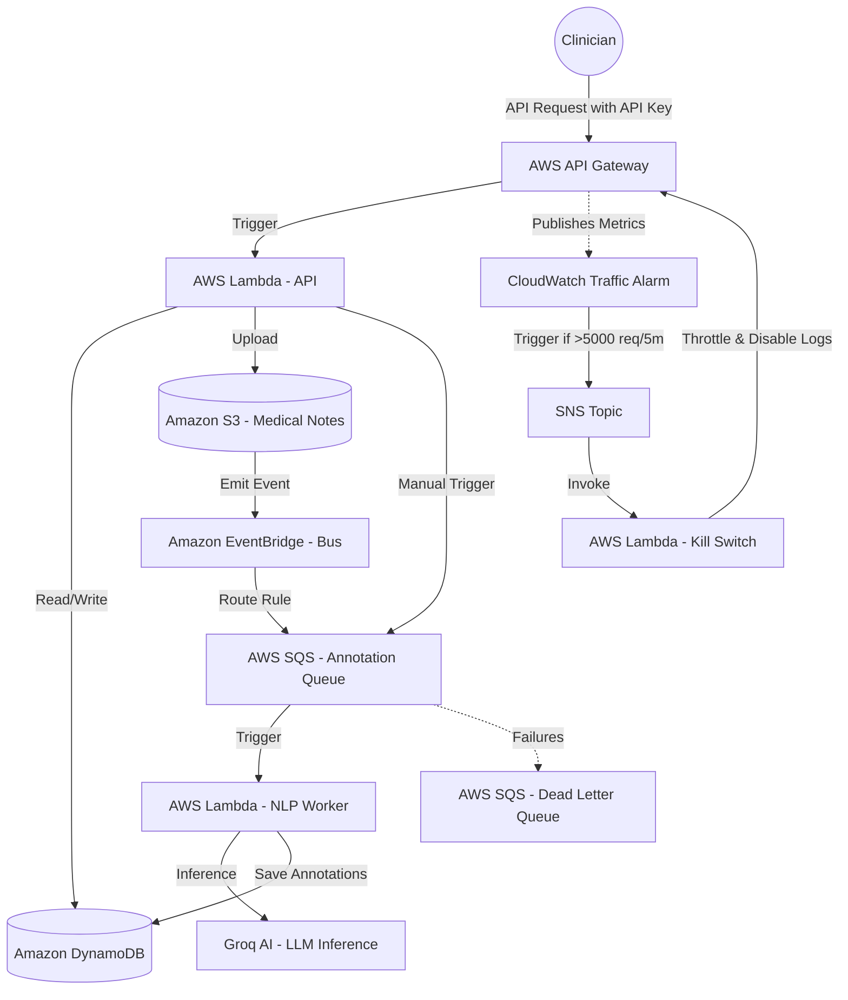

# EHR Annotation Platform - Backend

Enterprise-grade serverless backend for clinical document annotation, built with Hono and deployed on AWS.

## 🔗 Repository Links
- **Backend**: [https://github.com/harsh-vardhhan/EHR-backend](https://github.com/harsh-vardhhan/EHR-backend)
- **Frontend**: [https://github.com/harsh-vardhhan/EHR-frontend](https://github.com/harsh-vardhhan/EHR-frontend)

## 🏗 AWS Architecture

The backend follows a highly scalable, serverless architecture designed for clinical data residency and high availability.



### Infrastructure Components:
- **AWS Lambda (API)**: Executes the Hono application for UI interactions and document management.
- **AWS Lambda (NLP Worker)**: A dedicated asynchronous worker triggered by SQS for clinical entity extraction.
- **AWS Lambda (Kill Switch)**: Administrative helper function invoked by SNS to throttle the API Gateway stage to zero and disable CloudWatch logging/metrics under a DDoS traffic spike.
- **Amazon SQS & DLQ**: The "Shock Absorber" of the system. Handles buffering and retries for LLM inference, with a Dead Letter Queue for auditing failed processing jobs.
- **Amazon DynamoDB**: NoSQL database for ultra-low latency storage of annotation metadata and document status.
- **Amazon S3**: Secure, encrypted storage for raw clinical document text, serving as the event source for the ingestion pipeline.
- **Amazon API Gateway**: Managed entry point for the frontend, protected with API Key verification and strict rate limiting.
- **CloudWatch Alarm & SNS**: Tracks request count metric in real-time, acting as the circuit breaker sensor.
- **Groq AI Integration**: Powers the clinical entity recognition using high-performance LLM inference.

## 🚀 CI/CD Pipeline

The project uses GitHub Actions for an automated, zero-downtime deployment workflow.

### Continuous Integration (CI)
- **Linting**: Automated TypeScript linting ensures code quality.
- **Type Checking**: Strict TypeScript validation before every merge.
*Triggered on all Pull Requests to `main`.*

### Continuous Deployment (CD)
- **Build & Bundle**: Compiles TypeScript and uses `esbuild` for an optimized Lambda package.
- **AWS SAM (Serverless Application Model)**: Manages infrastructure as code, deploying the CloudFormation stack automatically.
- **Automatic Environment Sync**: Injects AWS secrets and environment variables during the build process.
*Triggered on every push to `main`.*

## 🛡️ Security & DDoS Protection

This backend is secured against automated billing exploits and volumetric API attacks using a hybrid protection system:

1. **API Key Authentication**: All public endpoints require a valid `x-api-key` header verified by API Gateway. Unauthenticated requests are rejected at the AWS edge before invoking any compute (Lambda) resources.
2. **Automated Traffic Circuit Breaker**:
   - A CloudWatch Alarm monitors the total API request volume.
   - If requests exceed `5000` within 5 minutes, the alarm triggers and sends an alert via SNS to your configured `NotificationEmail`.
    - The alert triggers the **Kill-Switch Lambda** (`EhrApiGatewayKillSwitchFunction`), which immediately throttles the `prod` stage of the API Gateway to 0 and disables CloudWatch logging and metrics, stopping all traffic processing and logging ingestion billing instantly.
3. **Manual Recovery**: To restore the stage and bring the application back online, simply reset the throttling limits and re-enable logging/metrics in the API Gateway Console, via the AWS SDK/CLI, or by redeploying the stack.

## 💸 Billing & Architectural Optimization

To ensure predictable pricing, prevent Lambda container freezes, and eliminate execution bottlenecks, the following architectural controls are implemented:

1. **SQS-Backed Asynchronous Hand-off**: Heavy tasks like NLP document analysis are decoupled from the API Lambda. The `/documents/:id/analyze` endpoint queues the task onto an Amazon SQS queue (`EhrAnnotationQueue`) and returns immediately. The **NLP Worker Lambda** then consumes the queue. This prevents background execution freezes on AWS Lambda.
2. **On-Demand DynamoDB Billing**: Database tables are configured to use `PAY_PER_REQUEST` (On-Demand) billing instead of provisioned throughput (which was limited to 5 RCU/WCU). This completely avoids database write throttling under heavy clinician activity while eliminating costs when idle.
3. **Groq API Request Timeout**: Outbound clinical NLP requests to the Groq API are strictly limited to an **8-second timeout** using an `AbortController`. This prevents hanging external API requests from keeping the Lambda function running up to its 30-second limit and inflating the bill.
4. **Parallel Database Writes**: When saving clinical entities, database writes are executed concurrently using `Promise.all` rather than sequentially. This reduces execution times by over 80%, directly lowering Lambda runtime duration billing.

## 🛠 Local Development

### Prerequisites
- Node.js 20+
- AWS CLI (configured for local testing)
- SAM CLI (optional, for local Lambda emulation)

### Setup
```bash
$ npm install
```

### Running Locally
```bash
# development
$ npm run start:dev
```

## 📜 Key Scripts
- `npm run build`: Compiles the application.
- `npm run bundle`: Creates a production-ready esbuild bundle for AWS Lambda.
- `npm run lint`: Runs the linter.
- `npm run test`: Executes unit tests.

---
*Built for the Modern Clinical Workflow.*
