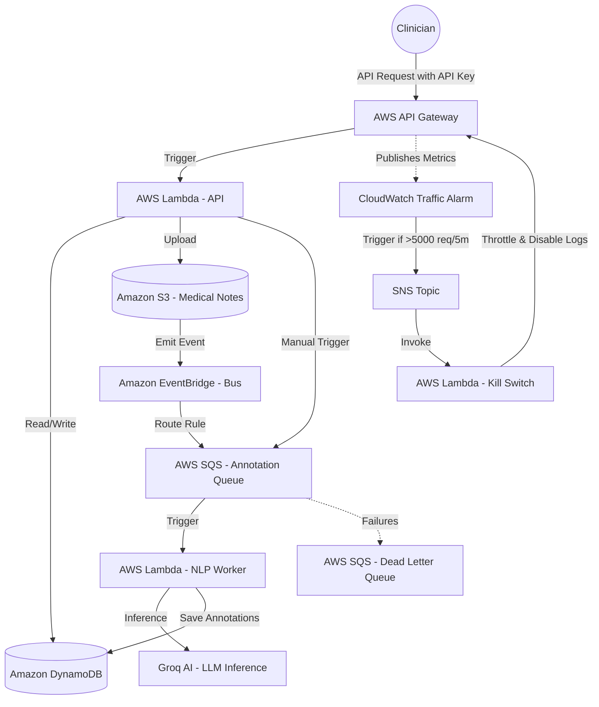

# EHR Annotation Platform - Backend

Enterprise-grade serverless backend for clinical document annotation, built with Hono and deployed on AWS.

## 🔗 Repository Links
- **Backend**: [https://github.com/harsh-vardhhan/EHR-backend](https://github.com/harsh-vardhhan/EHR-backend)
- **Frontend**: [https://github.com/harsh-vardhhan/EHR-frontend](https://github.com/harsh-vardhhan/EHR-frontend)

## 🏗 AWS Architecture

The backend follows a highly scalable, serverless architecture designed for clinical data residency and high availability.



### Infrastructure Components

| Component | Role in Architecture |
| :--- | :--- |
| **AWS Lambda (API)** | Executes the Hono application, handling UI interactions and document metadata orchestration. |
| **AWS Lambda (NLP Worker)** | Dedicated asynchronous worker triggered by SQS to perform LLM clinical entity extraction. |
| **AWS Lambda (Kill Switch)** | Administrative helper triggered by SNS to throttle API Gateway to zero and disable CloudWatch logging. |
| **Amazon SQS & DLQ** | Decouples document ingestion from analysis, buffers surges, and quarantines failed tasks in a Dead Letter Queue. |
| **Amazon DynamoDB** | Managed NoSQL storage for ultra-low latency storage of clinical annotation metadata and document status. |
| **Amazon S3** | Encrypted object storage for raw clinical document text, acting as the event source for the ingestion pipeline. |
| **Amazon API Gateway** | Managed entrance protected by mandatory API Key verification and usage plans. |
| **CloudWatch Alarm & SNS** | Monitors API request volume metrics in real-time, acting as the circuit breaker sensor. |
| **Groq AI Integration** | High-performance inference engine running clinical entity recognition models. |

## 🗄️ DynamoDB Single-Table Design

To maximize performance, cut database costs, and eliminate cross-table JOIN latency, this application uses a consolidated **Single-Table Design** layout (`EhrTable`) instead of traditional relational multi-table structures.

### Key Schema Layout

| PK (Partition Key) | SK (Sort Key) | Entity Type | Attributes & Schema |
| :--- | :--- | :--- | :--- |
| `DOCUMENT#<docId>` | `METADATA` | **Document** | `id`, `title`, `category`, `s3Key`, `status`, `createdAt` |
| `DOCUMENT#<docId>` | `ANNOTATION#<annotationId>` | **Annotation** | `annotationId`, `documentId`, `text`, `label`, `startOffset`, `endOffset`, `createdAt`, `source`, `status`, `confidence` |

### Query Optimizations

1. **Unified Read (Document + Annotations):** 
   When opening a patient note, the backend executes a single DynamoDB query where `PK = DOCUMENT#<docId>`. This retrieves the document metadata and all its annotations in a **single physical database operation**, reducing network roundtrips and latency by 50%.
2. **Inverted Index (`SKIndex`):**
   To update or delete an annotation by its `annotationId` alone (without knowing the parent `documentId`), we use a Global Secondary Index (GSI) called `SKIndex` (where `HashKey = SK` and `RangeKey = PK`). This resolves the parent `PK` in milliseconds, allowing targeted, isolated edits on specific rows.

## 🚀 CI/CD Pipeline

The project uses GitHub Actions for an automated, zero-downtime deployment workflow.

| Pipeline Stage | Processes | Actions & Best Practices | Trigger Event |
| :--- | :--- | :--- | :--- |
| **Continuous Integration (CI)** | • Linting<br>• Type Checking | Runs automated TypeScript linting and strict compilation checks. | All Pull Requests targeting `main` |
| **Continuous Deployment (CD)** | • Build & Bundle<br>• AWS SAM Deploy<br>• OIDC Authentication<br>• Env Variable Sync | Bundles files using `esbuild`, provisions CloudFormation stacks, signs in passwordlessly using OpenID Connect (OIDC), and syncs secrets. | Every commit/merge push to `main` |


## 🛡️ Denial of Wallet (DoW) & DDoS Protection

This backend incorporates a robust, multi-layered security architecture designed to prevent volumetric DDoS abuse and cloud-native **Denial of Wallet (DoW)** attacks, guaranteeing predictable operational billing.

| Defense Vector | Implementation & Controls | Purpose & Billing Safety Impact |
| :--- | :--- | :--- |
| **API Edge Gatekeeper** | Valid `x-api-key` header checked at API Gateway edge. | Rejects unauthenticated requests before triggering downstream Lambda compute or log metrics ingestion. |
| **Throttling & Quotas** | Usage plan capped at **50 req/s** rate, **20 burst**, and **50,000 req/month**. | Hard-limits client-specific query volume to prevent cost runaway from API key exposure or leakage. |
| **Automated Circuit Breaker** | CloudWatch Alarm (>5,000 req/5m) $\rightarrow$ SNS $\rightarrow$ Kill-Switch Lambda. | Automatically updates API Gateway stage throttle limits to `0` and disables metrics/logs ingestion on breach. |
| **Compute Scaling Caps** | `ReservedConcurrentExecutions` limits (**5** for API Lambda, **2** for SQS NLP Worker). | Caps the maximum number of concurrent running containers AWS can spin up under a flood. |
| **Asynchronous Decoupling** | SQS-backed queue hand-off (`EhrAnnotationQueue`) with `BatchSize: 5`. | Prevents container runtime crashes; processes spikes in document uploads sequentially rather than in parallel. |
| **Infinite Retry Defense** | SQS Dead Letter Queue (`EhrAnnotationDLQ`) with `maxReceiveCount: 3`. | Quarantines failing payloads (poison pills) to prevent endless execution retry loops. |
| **External API Timeouts** | Groq NLP call `AbortController` (strictly capped at **8 seconds**). | Prevents hung external LLM endpoints from keeping the worker Lambda running up to its 30-second cap. |
| **Database Cost Ceiling** | DynamoDB table configured with provisioned capacity (**5 RCU / 5 WCU**). | Acts as a budget boundary, preventing database scaling costs from skyrocketing during attacks. |
| **Compute Efficiency** | Parallel database writes via `Promise.all` instead of sequential writes. | Grouped DB actions run concurrently, reducing billable Lambda active execution time by over 80%. |

> [!TIP]
> **Manual Recovery after Circuit Breaker Activation:**
> To bring the system back online after a kill-switch trigger, reset the API Gateway stage throttling limits and re-enable execution logging via the AWS Console, AWS SDK/CLI, or by redeploying the SAM template.

## 🛠 Local Development

### Prerequisites
- Node.js 20+
- AWS CLI (configured via AWS IAM Identity Center/SSO profile e.g., `ehr-dev`)
- SAM CLI (optional, for local Lambda emulation)

### Setup
```bash
$ npm install
```

### Running Locally
```bash
# development
$ npm run start:dev
```

## 📜 Key Scripts
- `npm run build`: Compiles the application.
- `npm run bundle`: Creates a production-ready esbuild bundle for AWS Lambda.
- `npm run lint`: Runs the linter.
- `npm run test`: Executes unit tests.

---
*Built for the Modern Clinical Workflow.*
